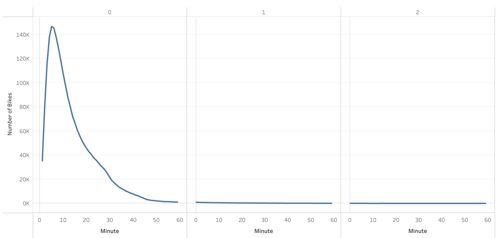
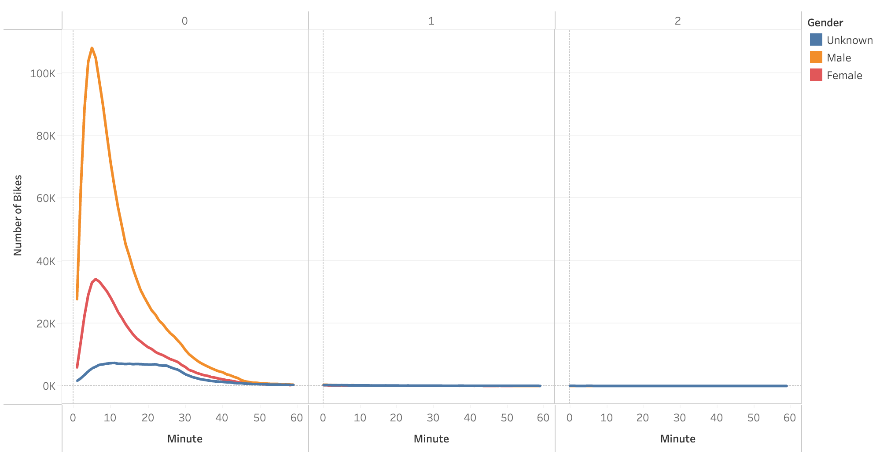
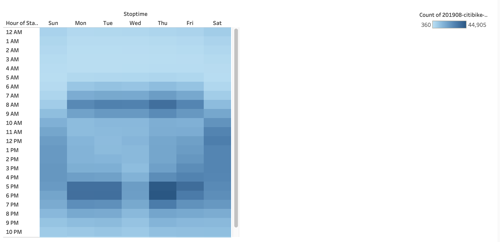
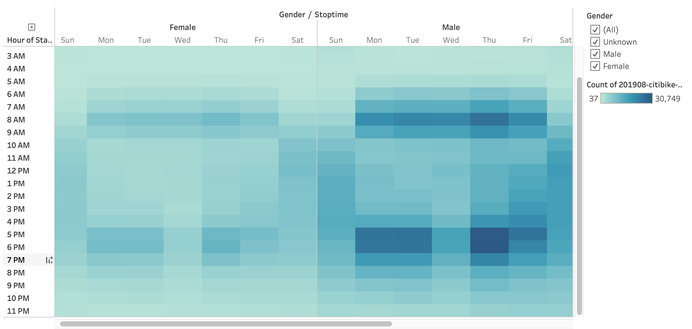
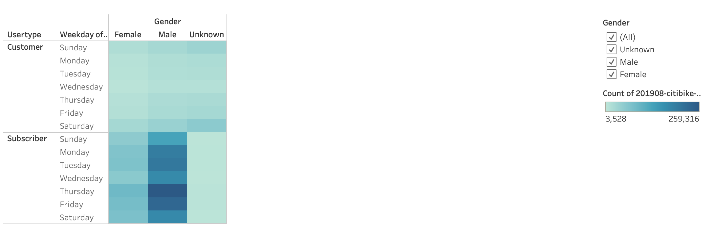

# Bikesharing Analysis using Tableau

## Overview

Following the success of New York City's Citibike program, we want to analyze usage data to evaluate if a similar bikesharing program can be successful in a different city. For the analysis, we used Citibike's August 2019 trip data, which includes trip duration, start and stop locations, start and stop times, user type and basic demographic information.

## Findings

[Tableau link](https://public.tableau.com/app/profile/kristin.dong/viz/CitiBikeChallenge_16538573940130/NYCCitibike?publish=yes)

For the month of August 2019, there were over **2.3 million** trips totaling more than **680,000 hours** of usage. Some interesting findings include:
- The average trip lasted **17.5 minutes**
- The majority of trips were taken by subscribers
- More trips were taken by males than females
- The majority of trips were made by users born **between 1980 and 2000** (Millennials and Gen Z)

Most trip durations are under **30 minutes**, with a mode of **five minutes** and very fews trips lasting more than one hour.

Trip duration by gender is similar to trip duration for all users combined. The mode is **six minutes** for female and **five minutes** for male.

The heatmap below shows usage by day of week and time of day. Usage is highest between 8AM to 9AM and between 5PM and 7PM from Monday to Friday, with lighter usage on Wednesday and Friday, and highest usage on Thursday. Usage on the weekend is more evenly distributed throughout the day. 

The usage pattern described above is similar when split by gender.

For male subscribers, peak usage is on Thursday and lowest usage is on Sunday. This pattern is similar but less prominent for female subscribers. Usage is highest on weekends for all non-subscribing customers regardless of gender.

## Summary and Recommendation

Based on this dataset, Citibike usage appears to be predominantely driven by relatively young, male subscribers. Most trips are short, lasting 17.5 minutes on average. During the workweek, usage is heaviest during morning and evening commute times, while weekend usage is more evenly distributed throughout the day. Usage patterns appear to be consistent across genders, although usage volumne is considerably lower for female than male.

To gain further insight into usage patterns and help determine optimal bike quantity and placement, the following analyis/visualization are recommended:
1. Average trip duration by day of week and start hour, segmented by user type
2. Determine what proportion of trips start and end at the same location vs. those that end at a different location
